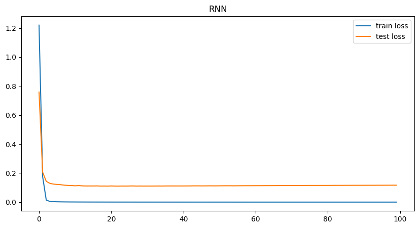
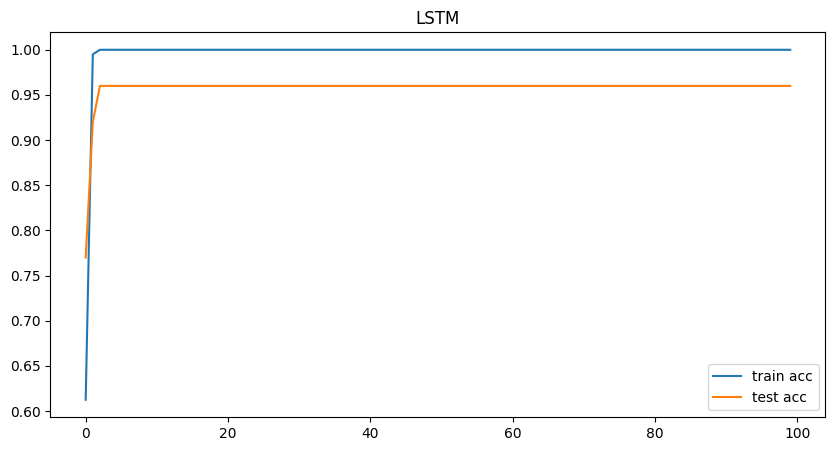
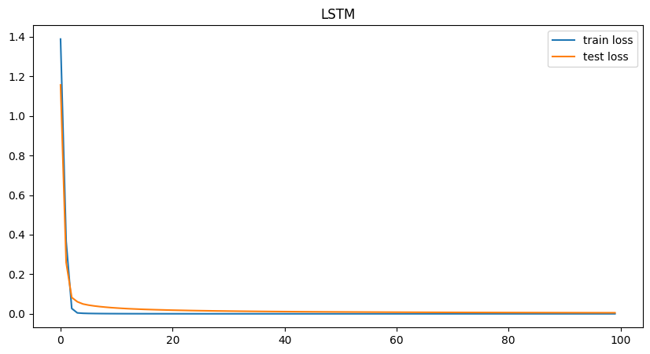
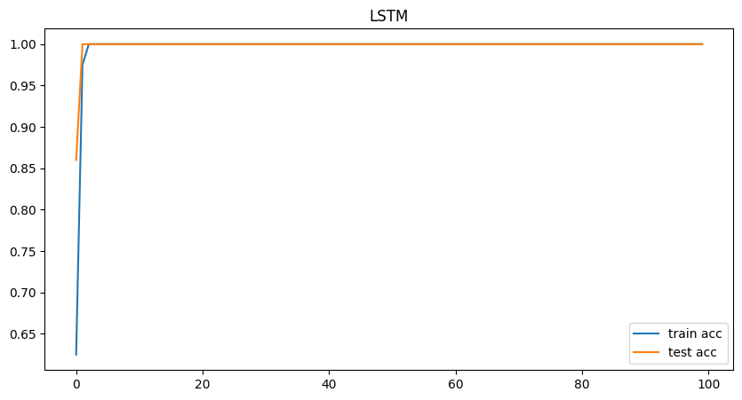

# Genetic Sequence Classifier

Welcome to the **Genetic Sequence Classifier** project! 🎉  
In this challenge, our goal is to train a Recurrent Neural Network (RNN)-based classifier to predict the labels of genetic code sequences. The sequences consist of letters `[‘A’, ‘C’, ‘G’, ‘T’]` and are classified into one of five categories `[0, 1, 2, 3, 4]`.

---

## 🚀 Project Overview

In this project, we are given a set of labeled and unlabeled genetic sequences represented by strings of length 400 and 1200 characters. Your task is to train an RNN or LSTM-based classifier to predict the missing labels for the test sequences. The process involves:
- **Training** on 400 labeled sequences.
- **Validating** on 100 labeled sequences.
- **Predicting** labels for 250 unlabeled sequences, which are then saved as a `.npy` file.

---

## 📂 Project Structure

The project is organized as follows:

- **`data/`**: Contains the dataset, including training (`data_x`, `data_y`), validation (`val_x`, `val_y`), and test (`test_x`) sequences.
- **`src/`**: Source code for training, evaluation, and model configuration:
    - **`config.py`**: Configuration file with hyperparameters and model settings.
    - **`train.py`**: Script for training the model.
    - **`rnn.py`**: Contains the RNN model architecture.
    - **`lstm.py`**: Contains the LSTM model architecture.
    - **`evaluation.py`**: Evaluates the trained models and saves performance metrics.
    - **`main.py`**: Entry point for executing the training and evaluation pipeline.
- **`outputs/`**: Stores output results such as loss/accuracy curves and model predictions:
    - **`rnn-loss-curve.png`**: RNN model's loss curve during training.
    - **`rnn-accuracy-curve.png`**: RNN model's accuracy curve during training.
    - **`lstm-loss-curve.png`**: LSTM model's loss curve during training.
    - **`lstm-accuracy-curve.png`**: LSTM model's accuracy curve during training.

---

## 📋 Files Overview

- **`config.py`**: Contains model configurations, hyperparameters, and paths for data and output directories.
- **`train.py`**: Handles the training process of the RNN or LSTM model.
- **`rnn.py`**: Defines the architecture of the RNN model.
- **`lstm.py`**: Defines the architecture of the LSTM model.
- **`evaluation.py`**: Functions to evaluate model performance and save metrics and images.
- **`main.py`**: Runs the full training and evaluation pipeline.

---

## 🛠 Setup & Installation

### 1. Clone the repository:

```bash
git clone https://github.com/yourusername/genetic-sequence-classifier.git
cd genetic-sequence-classifier
```

### 2. Install required dependencies:

```bash
pip install -r requirements.txt
```

### 3. Prepare the dataset:

Place your genetic sequence dataset (training and test sequences) in the `data/` folder. The dataset includes:
- **Training data**: `data_x` (400 sequences, each 400 characters), `data_y` (labels).
- **Validation data**: `val_x` (100 sequences, each 1200 characters), `val_y` (labels).
- **Test data**: `test_x` (250 sequences, each 2000 characters).

---

## 🚀 How to Train and Evaluate the Model

### 1. Train the RNN model:

```bash
python src/train.py --model rnn
```

### 2. Train the LSTM model:

```bash
python src/train.py --model lstm
```

Both scripts will save training results (accuracy and loss curves) as images in the `outputs/` folder:
- **RNN**: `rnn-loss-curve.png` and `rnn-accuracy-curve.png`.
- **LSTM**: `lstm-loss-curve.png` and `lstm-accuracy-curve.png`.

---

## 📈 Model Evaluation

After training the models, you can evaluate them using the validation set. The evaluation results (such as accuracy and loss) will be saved as images in the `outputs/` folder. You can use the following commands:

### 1. Evaluate RNN Model:

```bash
python src/evaluation.py --model rnn
```

### 2. Evaluate LSTM Model:

```bash
python src/evaluation.py --model lstm
```

These scripts will generate the loss and accuracy curves for the models, which can be found in the `outputs/` folder.

---

## 📝 Make Predictions

After training the models, use the following commands to generate predictions for the test set and save the results as `prediction.npy`:

### 1. Predict using the RNN Model:

```bash
python src/main.py --model rnn --predict
```

### 2. Predict using the LSTM Model:

```bash
python src/main.py --model lstm --predict
```

The predictions will be saved in a file named `prediction.npy`, which should be submitted as your result.

---

## 📂 Results

The following images will be saved in the `outputs/` folder as part of the training and evaluation process:
- **RNN**: 
- **Loss Curve**:   
- **Accuracy Curve**: 
  
- **LSTM**:
- **Loss Curve**:   
- **Accuracy Curve**:   
---

## 📝 License

This project is licensed under the **MIT License**. See the [LICENSE](LICENSE) file for details.

---

## 🏆 Contributing

Feel free to contribute to this project! Open an issue or submit a pull request if you have suggestions, improvements, or bug fixes. 🚀

---

## 💬 Contact

If you have any questions or suggestions, feel free to reach out:  
- Email: skcberlin dot gmail.com  
- LinkedIn: 

---
