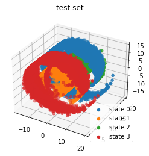
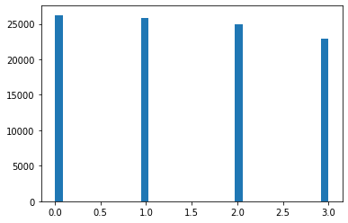

```markdown
# Time Series Dimensionality Reduction and Clustering

Welcome to the **Time Series Dimensionality Reduction and Clustering** project! 🎉  
This project aims to perform dimensionality reduction on three-dimensional time series data and to cluster the data into four metastable states.

## 🚀 Project Overview

You are provided with a three-dimensional time series dataset with 100,000 data points. The data points belong to four metastable states, which need to be separated in a one-dimensional representation. The goal of this project is to:
1. Reduce the data's dimensionality from 3D to 1D while ensuring that the four metastable states become disentangled.
2. Discretize the 1D representation by assigning each data point to one of the four metastable states (labeled from {0, 1, 2, 3}).

### Task Breakdown
- **Dimensionality Reduction**: Transform the original 3D data into a 1D time series representation.
    - A time-lagged autoencoder is recommended for this task.
    - Proper data whitening may help improve results.
  
- **Discretization**: After reducing the dimensionality, assign each data point to a specific metastable state.
    - You can use clustering techniques or define cluster centers manually.

---

## 📂 Project Structure

The project is organized into the following folders and files:

- **`data/`**: Contains the dataset of time series data (training and validation sets).
- **`src/`**: Contains the source code for the project:
    - **`config.py`**: Configuration settings for the project (e.g., hyperparameters, paths).
    - **`autoencoder.py`**: Code for building and training the time-lagged autoencoder model.
    - **`train.py`**: Training script for the autoencoder model.
    - **`evaluation.py`**: Evaluation code to assess model performance.
    - **`main.py`**: Main script to execute the project workflow (dimension reduction, discretization, and evaluation).
- **`outputs/`**: Stores the results of the model's training and testing:
    - **`test-set-prediction-clustering.png`**: Visualization of the test set predictions and clustering results.
    - **`prediction-hist.png`**: Histogram showing the distribution of the predicted clusters.

---

## 📋 Files Overview

### `config.py`
- Contains configuration parameters like model hyperparameters, dataset paths, and other global settings.

### `autoencoder.py`
- Defines and trains the time-lagged autoencoder model to perform dimensionality reduction.

### `train.py`
- Contains the code to train the autoencoder model on the dataset.

### `evaluation.py`
- Contains the functions to evaluate the model, including metrics for clustering performance.

### `main.py`
- The entry point of the project, which runs the entire pipeline: dimensionality reduction, discretization, and evaluation.

---

## 🛠 Setup & Installation

### 1. Clone the repository:

```bash
git clone https://github.com/sureshkuc/time-series-dim-reduction.git
```

### 2. Install dependencies:

```bash
pip install -r requirements.txt
```

### 3. Prepare the dataset:

Place your dataset files (training, validation, and test sets) in the `data/` folder.

---

## 🚀 How to Run the Project

### 1. Run the whole pipeline:

```bash
python src/main.py
```

This script will:
- Perform dimensionality reduction using the time-lagged autoencoder.
- Discretize the 1D representation by clustering the data into four metastable states.
- Generate visualizations and save them to the `outputs/` folder.

### 2. Training the Autoencoder:

```bash
python src/train.py
```

This will train the autoencoder model on the provided dataset.

### 3. Model Evaluation:

```bash
python src/evaluation.py
```

This will evaluate the model's performance on the validation dataset and visualize the results.

---

## 📈 Results and Visualizations

After running the project, you will find the following outputs in the `outputs/` folder:

- **`test-set-prediction-clustering`**:   
A visualization showing the predicted clusters for the test set.
- **`Histogram`**:   
A histogram of the distribution of predicted clusters.
---

## 📝 License

This project is licensed under the **MIT License**. See the [LICENSE](LICENSE) file for details.

---

## 🏆 Contributing

Feel free to contribute to this project! Open an issue or submit a pull request if you have suggestions, improvements, or bug fixes. 🚀

---

## 💬 Contact

If you have any questions or suggestions, feel free to reach out:
- Email: skcberlin dot gmail.com
- LinkedIn: 
```
