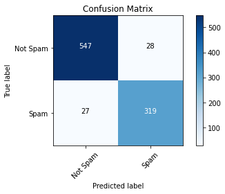
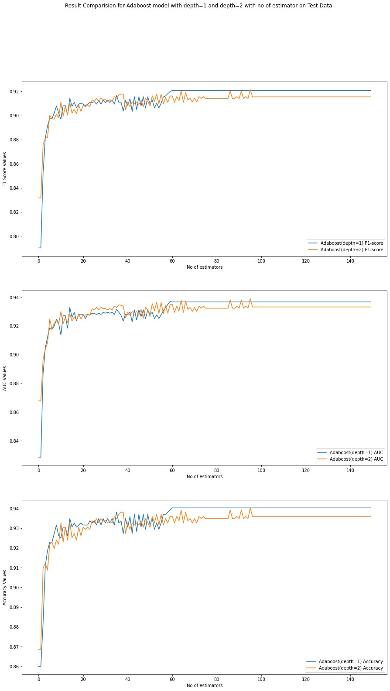

```markdown
# 📬 AdaBoost Classifier on SPAM Dataset

AdaBoost Implementation** – a hands-on machine learning project where we build the AdaBoost ensemble learning algorithm from scratch using **Python** and **NumPy**, and apply it to the **SPAM dataset**. Our weak learners are decision stumps (1-level decision trees), and we evaluate model performance using various metrics and visualizations.


---

## 📌 Project Goals

- ✅ Implement AdaBoost from scratch using Python & NumPy
- ✅ Use decision stumps as weak classifiers
- ✅ Apply the model to a binary **SPAM classification** problem
- ✅ Evaluate model performance (confusion matrix, AUC, F1-score)
- ✅ Explore the effect of using stronger weak learners (depth-2 trees)

---

## 📁 Project Structure

├── README.md
├── requirements.txt
├── src/
│   ├── config.py              # Configuration constants
│   ├── decision\_stump.py      # Weak learner (depth-1 decision tree)
│   ├── adaboost.py            # AdaBoost algorithm
│   ├── train.py               # Training logic
│   ├── main.py                # Project entry point
│   ├── plot.py                # Visualizations (confusion matrix, AUC, etc.)
│   ├── evaluation.py          # Evaluation metrics
│   └── utils.py               # Data loading, preprocessing, utilities
├── outputs/
│   ├── cm.png                 # Confusion matrix image
│   ├── auc.png                # ROC-AUC curve image
│   ├── F1-score.png           # F1-score visualization
│   └── ...                    # Other model outputs


---

## 🧠 What is AdaBoost?

**AdaBoost (Adaptive Boosting)** is an ensemble learning method that combines multiple weak classifiers (in our case, decision stumps) into a strong one. It iteratively adjusts the weights of misclassified samples, enabling later learners to focus more on harder examples.

---

## 🔧 Setup Instructions

### 1. Clone the repository

### 2. Install dependencies

We recommend using a virtual environment.

```bash
pip install -r requirements.txt
```

### 3. Run the project

```bash
python src/main.py
```

This will load the SPAM dataset, train the AdaBoost model using decision stumps, and generate evaluation outputs.

---

## 📊 Evaluation & Results

* ✅  ### Confusion Matrix  


* ✅ ###  F1-Score, ROC-AUC Curve and Accuracy   



### 🔁 Experiment: Stronger Weak Learners?

We also trained an AdaBoost model using depth-2 decision trees to evaluate whether stronger weak learners improve results. You can toggle this experiment in `config.py`.

**Conclusion**:

> AdaBoost tends to perform **best with weak learners**. Using depth-2 trees led to **overfitting** in some cases due to increased model complexity. Simpler weak learners like stumps allow AdaBoost to focus on errors incrementally, boosting generalization performance.

---

## 📌 Key Files

* `adaboost.py`: Core AdaBoost algorithm
* `decision_stump.py`: Implementation of decision stumps
* `train.py`: Training pipeline
* `evaluation.py`: Computes metrics like precision, recall, F1, AUC
* `plot.py`: Generates visualizations
* `main.py`: Entry script

---

## 📎 Requirements

All dependencies are listed in `requirements.txt`. Major ones include:

* `numpy`
* `matplotlib`
* `scikit-learn` (used only for metrics, not for models)

---

## 📜 License

This project is licensed under the **MIT License** – see the [LICENSE](LICENSE) file for details.

---

## 🤝 Contributing

Contributions are welcome! If you'd like to fix a bug, add a feature, or suggest improvements, feel free to open an issue or submit a pull request.

---

## 📬 Contact

If you have any questions or feedback, feel free to reach out:

* **Email**: [skcberlin  gmail]
---

*Thanks for checking out this project! 🌟*

```
