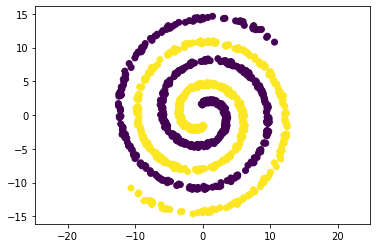

---

````markdown
# 🌀 DBSCAN Classifier on Two-Spirals Dataset

This project implements a **DBSCAN clustering algorithm** from scratch using **NumPy** and **Matplotlib**, and evaluates its performance on the famous **Two-Spirals dataset**.

## 📌 Assignment Description

> **Exercise 1: Implementation of a DBSCAN-Classifier**  
> Implement a DBSCAN-Clustering in Python (incl. Numpy, Matplotlib) on the Jupyter Notebook Environment.  
> Apply the algorithm on the “Two-Spirals” dataset.  

### Requirements:
- Implement DBSCAN from scratch.
- Evaluate and visualize clustering on the Two-Spirals dataset.
- Tune hyperparameters `eps` and `minPts` for optimal results.
- Print clustering accuracies for varying dataset sizes.
- Discuss limitations and disadvantages of DBSCAN.

---

## 🗂️ Project Structure

```plaintext
├── data/               # Contains the Two-Spirals dataset
├── docs/               # Documentation (design notes, analysis, references)
├── outputs/            # All generated outputs and plots
│   ├── data.png
│   ├── accuracy.png
│   ├── silhoute_score.png
│   └── ...
├── src/                # Source code
│   ├── config.py       # Configuration and hyperparameter settings
│   ├── model.py        # DBSCAN model implementation
│   ├── plot.py         # Visualization utilities
│   ├── main.py         # Entry point: loading data, training, and execution
│   └── evaluation.py   # Evaluation metrics and scoring
├── requirements.txt    # Project dependencies
└── README.md           # This file
````

---

## 🔍 Features

* ✅ DBSCAN implemented from scratch using python and NumPy
* 📊 Matplotlib visualizations of clustered results
* 📈 Evaluation of clustering accuracy and silhouette score
* 🔧 Hyperparameter tuning for `eps` and `minPts`
* 📉 Analysis of algorithm failures on small data sizes

---

## 🧪 Results

You can find visual outputs in the `outputs/` folder:

* `data.png`: Visualizes the original Two-Spirals dataset
* `accuracy.png`: Shows accuracy trends for different data sizes
* `silhoute_score.png`: Silhouette scores per clustering run

Sample output (see `/outputs/`):


---

## 🚀 Getting Started

### Prerequisites

* Python 3.8+
* `virtualenv` or `conda` (recommended)

### Installation

1. **Clone this repository:**

   ```bash
   git clone https://github.com/sureshkuc/dbscan-two-spirals.git
   cd dbscan-two-spirals
   ```

2. **Create virtual environment and activate:**

   ```bash
   python -m venv venv
   source venv/bin/activate  # On Windows: venv\Scripts\activate
   ```

3. **Install dependencies:**

   ```bash
   pip install -r requirements.txt
   ```

4. **Run the project:**

   ```bash
   python src/main.py
   ```

---

## 📈 Evaluation Metrics

Implemented in `evaluation.py`:

* Accuracy based on cluster-label match
* Silhouette Score
* Cluster purity (optional)

---

## ❓ Analysis & Limitations

### When DBSCAN Fails:

* DBSCAN may fail when `data_size` is very small.
* Sparse data makes it hard to define dense neighborhoods, leading to noise.

### Disadvantages of DBSCAN:

* Sensitive to hyperparameters (`eps`, `minPts`)
* Struggles with varying density in clusters
* High-dimensional data reduces distance effectiveness

---

## 🧠 Technologies Used

* Python 🐍
* NumPy ⚙️
* Matplotlib 📊
* Jupyter Notebook (for initial prototyping)

---

## 📄 License

This project is open-source and available under the [MIT License](LICENSE).


---
```
