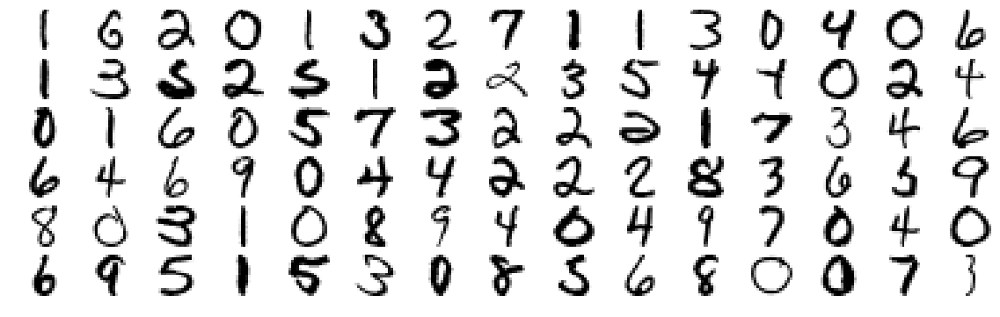
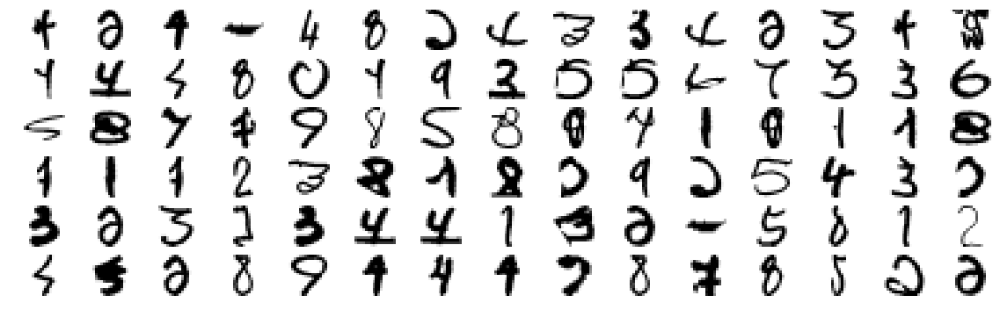

```markdown
# 📌 k-Nearest Neighbors (k-NN) Classifier

Welcome to the **k-NN Classifier** project! 🎯  
This project implements a **k-Nearest Neighbors (k-NN) classifier** using **Python (NumPy, Pandas, Matplotlib)** in a **Jupyter Notebook** environment.  
We use the **ZIP-Code Dataset** for training and evaluate its performance on test data.

---

## 📂 Project Structure

The project is organized as follows:

- **`src/`** → Source code files:
  - `config.py` → Configuration settings
  - `model.py` → k-NN model implementation
  - `train.py` → Training script for the k-NN classifier
  - `evaluation.py` → Model evaluation and accuracy calculation
  - `main.py` → Entry point to execute training and evaluation

- **`data/`** → Contains the dataset (ZIP-Code training & test data)
- **`outputs/`** → Stores results (accuracy scores, misclassified images, etc.)
  - `digit-images.png` → Example images from the dataset
  - `missclassified-images.png` → Images that were classified incorrectly
- **`documents/`** → Additional documentation and notes
- **`requirements.txt`** → Dependencies for setting up the environment
- **`README.md`** → Project overview and usage guide

---

## 📊 Model Performance

The classifier was tested with different values of **k**, and the accuracy results are:

| **k-value** | **Accuracy** |
|------------|-------------|
| k = 1      | 94.37%      |
| k = 2      | 94.12%      |
| k = 3      | 94.47%      |

📌 **Best accuracy achieved at k = 3** (94.47%).

---

## 🔥 Features Implemented

✔ Implementation of **k-NN from scratch**  
✔ Training and evaluating the classifier using the **ZIP-Code Dataset**  
✔ **Accuracy calculation** and evaluation on test data  
✔ **Visualization of misclassified images** using Matplotlib  
✔ **Comparison of accuracy** for different values of k  

---

## ⚙️ Setup & Installation

### 1️⃣ Clone the Repository:

```bash
git clone https://github.com/sureshkuc/kNN-Classifier.git
cd kNN-Classifier
```

### 2️⃣ Install Dependencies:

```bash
pip install -r requirements.txt
```

### 3️⃣ Run the Classifier:

To train and evaluate the model:

```bash
python src/main.py
```

---

## 📈 Visualizing Results

📌 **Correctly Classified Digits**


📌 **Misclassified Digits**


---

## 🔍 Evaluation Criteria

1. **Print out the accuracy** of the k-NN classifier.
2. **Plot incorrectly classified images** using Matplotlib.
3. **Determine the optimal k-value** for accuracy.
4. **Discuss advantages and disadvantages** of k-NN.

---

## ✅ Advantages & ❌ Disadvantages of k-NN

✅ **Advantages:**
- Simple and intuitive algorithm
- No training phase (lazy learning)
- Works well with small datasets

❌ **Disadvantages:**
- Computationally expensive for large datasets
- Sensitive to irrelevant features and noise
- Requires optimal selection of **k** for best performance

---

## 📝 License

This project is licensed under the **MIT License**. See the [LICENSE](LICENSE) file for details.

---

## 💡 Contributing

Feel free to contribute by **opening an issue** or **submitting a pull request**! 🚀

---

## 📩 Contact

📧 Email: skcberlin dot gmail.com  
💼 LinkedIn: 
---

```
