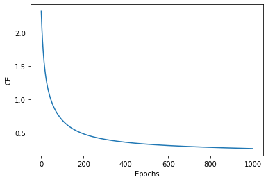

```markdown
# Perceptron and Multilayer Perceptron (MLP) Implementation

This repository contains Python implementations of:
- A **Perceptron algorithm** applied to the Iris Dataset
- A **Multilayer Perceptron (MLP)** with configurable architecture applied to the ZIP Dataset

---

## 📁 Project Structure

```

├── data/                          # Datasets (e.g. Iris, ZIP)
├── docs/                          # Documentation resources
├── outputs/                       # Model outputs and visualizations
│   └── mlp\_accuracy.png           # Accuracy plot for MLP
├── src/                           # Source code
│   ├── config.py
│   ├── evaluation.py
│   ├── main.py
│   ├── myperceptron.py
│   ├── multilayerperceptron.py
│   ├── plot.py
│   ├── train\_myperceptron.py
│   ├── train\_multilayerperceptron.py
│   └── utils.py
├── README.md                      # Project overview (this file)
└── requirements.txt               # Python dependencies

````

---

## 🔬 Exercise 1: Perceptron

### ✅ Goal
Implement the **Perceptron algorithm** using Python and NumPy and apply it to the **Iris dataset**.

### 🎯 Task
- Train the model to **separate Setosa from Versicolour and Virginica**.
- Evaluate how the algorithm performs in this binary classification setup.

###  Further Analysis
- (a) What happens when the Perceptron tries to separate **Versicolour from Virginica**?
  - Try **multiple runs** to analyze the variance in accuracy.
- (b) Devise a method to **improve performance** and report the **final accuracy**.

You can run this part using:
```bash
python src/train_myperceptron.py
````

---

## 🤖 Exercise 2: Multilayer Perceptron (MLP)

### ✅ Goal

Implement an MLP class with:

* Variable **depth** `D` (number of layers)
* Variable number of **neurons** `nᵢ` in each layer `i = 1, ..., D`

### 📦 Dataset

* The model is trained and tested on the **ZIP dataset**.

### 🧪 How to Run

```bash
python src/train_multilayerperceptron.py
```

### 📈 Results

The following plot shows the accuracy of the MLP on the ZIP dataset:



---

## ⚙️ Installation

1. Clone the repo:


2. Create a virtual environment and install requirements:

```bash
python -m venv venv
source venv/bin/activate  # or venv\Scripts\activate on Windows
pip install -r requirements.txt
```

---

## 🧠 Source Files Overview

| File                            | Description                          |
| ------------------------------- | ------------------------------------ |
| `config.py`                     | Configuration parameters             |
| `myperceptron.py`               | Perceptron class implementation      |
| `train_myperceptron.py`         | Training script for the perceptron   |
| `multilayerperceptron.py`       | MLP class implementation             |
| `train_multilayerperceptron.py` | Training script for MLP              |
| `evaluation.py`                 | Evaluation metrics and accuracy calc |
| `plot.py`                       | Code to generate plots               |
| `utils.py`                      | Helper functions                     |
| `main.py`                       | Entry point for integrated pipelines |

---

## 📬 Feedback and Contributions

Feel free to open issues or submit pull requests. Contributions are welcome!

---

## 📜 License

This project is licensed under the MIT License.

---

## 📌 References

1. [Iris Dataset - UCI Repository](https://archive.ics.uci.edu/ml/datasets/iris)
2. [ZIP Code Dataset](https://cs.nyu.edu/~roweis/data.html)

```
```

