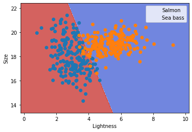
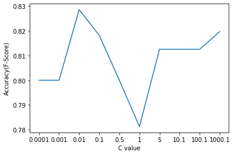

```markdown
# 🌸 Project 4: Soft-Margin Support Vector Machine on Iris Dataset

Welcome to **Project 4**, where we implement a **Soft-Margin Support Vector Machine (SVM)** algorithm to classify the famous **Iris dataset**. The goal is to **clean**, **train**, **evaluate**, and **visualize** SVM model performance on this classic dataset.



---

## 🧠 Project Overview

This project walks through:
- Cleaning and preprocessing the **Iris dataset**
- Training a **Soft-Margin SVM** model from scratch
- Evaluating the model with metrics and visualizations

---

## 📁 Directory Structure

project4-svm-iris/
│
├── README.md                  <- Project documentation
├── requirements.txt           <- Python dependencies
│
├── data/
│   └── iris.csv               <- Original raw dataset (optional)
│
├── outputs/                   <- Output files and result plots
│   ├── data.png
│   ├── accuracy.png
│   ├── prediction.png
│
├── src/                       <- Source code
│   ├── config.py              <- Configuration settings
│   ├── data\_quality.py        <- Data cleansing functions
│   ├── model.py               <- Soft-margin SVM model implementation
│   ├── train.py               <- Model training logic
│   ├── evaluation.py          <- Model evaluation (accuracy, confusion matrix)
│   ├── plot.py                <- Plotting functions
│   └── main.py                <- Pipeline entry point

---

## 🔧 Setup & Installation

### 1. Clone the repository
```bash
git clone https://github.com/sureshkuc/project4-svm-iris.git
cd project4-svm-iris
````

### 2. Create virtual environment (optional but recommended)

```bash
python -m venv venv
source venv/bin/activate  # On Windows use `venv\Scripts\activate`
```

### 3. Install dependencies

```bash
pip install -r requirements.txt
```

---

## 🚀 How to Run the Project

### 1. Clean the dataset

```bash
python src/data_quality.py
```

### 2. Train the model

```bash
python src/train.py
```

### 3. Evaluate and visualize results

```bash
python src/evaluation.py
```

### 4. Run the full pipeline

```bash
python src/main.py
```

---

## 📊 Output Visuals

Visualizations and results are saved in the `outputs/` folder.

| Visualization                         | Description                       |
| ------------------------------------- | --------------------------------- |
|              | Visualizes cleaned input data     |
|      | Model training/test accuracy plot |
|  | Prediction result visualization   |

---

## 🛠 Technologies Used

* Python 🐍
* Numpy, Pandas
* Matplotlib, Seaborn
* Scikit-learn (for comparison or utilities)

---

## 📈 Evaluation Metrics

* Accuracy
* Precision, Recall
* Confusion Matrix
* Visualization of Decision Boundary

---

## 📝 License

This project is licensed under the **MIT License**. See the [LICENSE](LICENSE) file for more details.

---

## 🤝 Contributing

Contributions are welcome! If you find a bug or want to improve something, feel free to fork this repo and submit a PR.

---

## 📬 Contact

Have questions? Reach out via:

* 📧 Email: `skcberlin [at] gmail.com`

```

