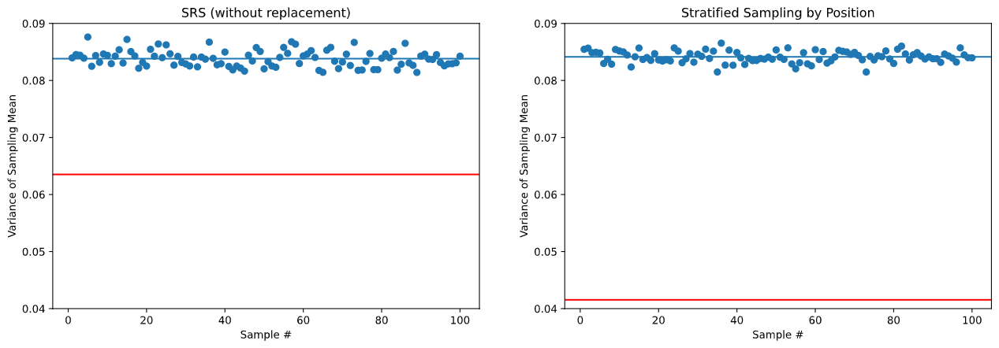
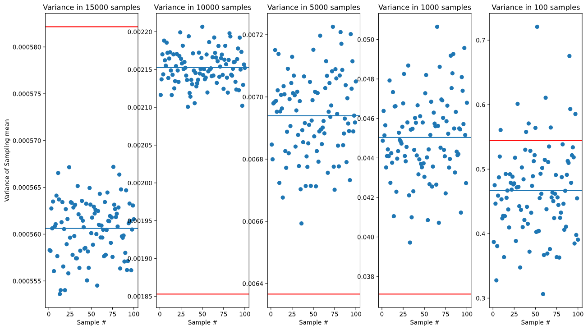
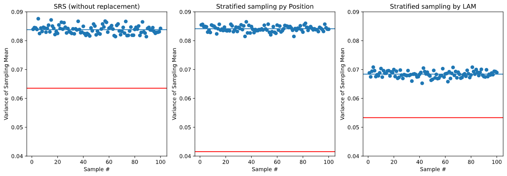

````markdown
# 📊 Variance Sampling Analysis

Welcome to the **Variance Sampling Analysis** project! 🎯  
This project demonstrates how different sampling techniques—**Simple Random Sampling** and **Stratified Sampling**—affect the **variance estimation** on different sample sizes using a real-world dataset.


---

## 🚀 Project Objective

The primary goal is to:
- Implement variance estimation using:
  - ✅ **Simple Random Sampling (SRS)** without replacement
  - ✅ **Stratified Sampling**
- Analyze and compare the variances across different sample sizes
- Visualize results for better understanding and interpretation

---

## 📂 Project Structure

```bash
.
├── README.md                  # Project overview and instructions
├── requirements.txt           # Python dependencies
├── src/
│   └── variance_sampling_analysis.py  # Core logic for sampling and variance analysis
├── outputs/
│   ├── ex3.png, ex4.png, ...          # Resulting visualizations
│   └── *.csv / *.txt                  # Output files (if any)
````

---

## 🧠 Techniques Used

* **Simple Random Sampling Without Replacement (SRSWOR)**
  Each sample has an equal probability of being chosen without replacement.

* **Stratified Sampling**
  The population is divided into strata (subgroups), and samples are taken from each stratum for more representative analysis.

---

## 🖼 Sample Outputs

Visualizations generated in the `outputs/` folder include:

| Technique  | Sample Size Variation        | Visualization                |
| ---------- | ---------------------------- | ---------------------------- |
| SRS        | Various n values             |       |
| Stratified | With proportional allocation |  |
| Comparison | Between techniques           |       |

---

## 🛠 Installation & Setup


### 2. Install dependencies

```bash
pip install -r requirements.txt
```

---

## ▶️ Run the Analysis

Run the main analysis script from the root directory:

```bash
python src/variance_sampling_analysis.py
```

The results will be printed to the console and saved in the `outputs/` folder.

---

## 📈 Results & Observations

* Stratified sampling generally yields **lower variance** when strata are well-defined.
* As the sample size increases, the variance decreases for both methods.
* Visualization plots highlight the **efficiency and stability** of each technique.

---

## 📃 License

This project is licensed under the MIT License. See the [LICENSE](LICENSE) file for more details.

---

## 🤝 Contributing

Contributions are welcome! If you find issues or want to extend this project, feel free to:

* Open an issue
* Fork the repo and submit a pull request
* Share feedback or suggest improvements

---

## 📬 Contact

If you have questions or ideas, reach out to:

* 📧 Email: [skcberlin [ at ] gmail.com](mailto:skcberlin@gmail.com)


```

