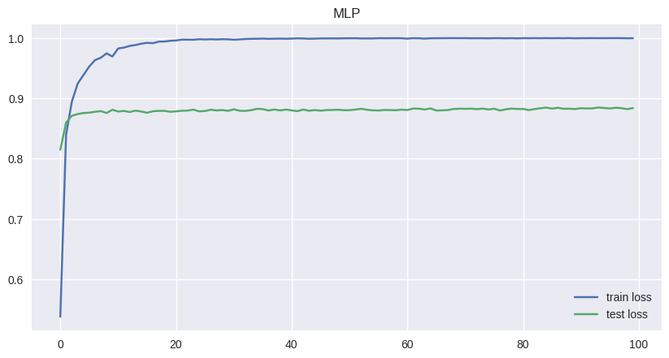
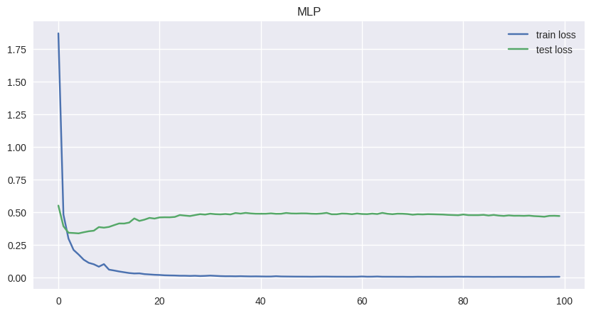

---

```markdown
# 🧬 Deep Learning for Taxonomic Classification of Metagenomic Data


This project explores **Deep Learning-based approaches** for classifying metagenomic sequences and compares their performance with traditional models like the RDP Classifier.




---

## 🎯 Project Goals

- Taxonomic classification of metagenomic data using deep learning techniques.
- Compare the performance of Deep Learning models against the RDP classifier using a **10-fold cross-validation** scheme.
- Analyze results using **Accuracy**, **Precision**, **Recall**, and **F1-Score** metrics.
- Evaluate models using **k-mers of length 3 to 7** as features.
- Demonstrate how increasing the k-mer size generally improves performance.
- Show that **CNN** and **DBN** models outperform traditional classifiers for this task.
- Identify **DBN** as particularly effective even with smaller k-mer sizes (`k < 7`).

---

## 📁 Project Structure

```
├── data/               # Input data and processed datasets
├── docs/               # Documentation and references
├── outputs/            # Output results, plots, and saved models
│   ├── accuracy-curve.png
│   └── loss-curve.png
├── src/                # Source code for model training and evaluation
│   ├── config.py
│   ├── model.py
│   ├── plot.py
│   ├── main.py
│   ├── evaluation.py
│   └── train.py
├── requirements.txt    # Python dependencies
└── README.md           # Project documentation (this file)
```

---

## 🛠 Setup & Installation

1. **Clone the Repository**
```bash
git clone https://github.com/yourusername/metagenomics-taxonomy-classifier.git
cd metagenomics-taxonomy-classifier
```

2. **Install Dependencies**
```bash
pip install -r requirements.txt
```

3. **Prepare Dataset**
- Place the processed k-mer datasets inside the `data/` folder.
- Update paths in `src/config.py` if needed.

---

## 🚀 Running the Project

### Train Models:
```bash
python src/train.py
```

### Evaluate Results:
```bash
python src/evaluation.py
```

### Plot Performance:
```bash
python src/plot.py
```

---

## 📊 Results Summary

| Model | Best k-mer | Accuracy | Precision | Recall | F1-Score |
|-------|------------|----------|-----------|--------|----------|
| CNN   | 7          | ✅ High  | ✅ High   | ✅ High| ✅ High  |
| DBN   | 6, 7       | ✅ High  | ✅ Good   | ✅ Good| ✅ Good  |
| RDP   | -          | ❌ Lower | ❌ Lower  | ❌ Lower| ❌ Lower |

- **CNN and DBN** models consistently outperform the RDP classifier.
- Accuracy increases with larger **k-mer sizes**.
- Best results achieved with `k=7`.

---

## 📈 Visual Insights

### Accuracy Curve


### Loss Curve


---

## 📄 License

This project is licensed under the **MIT License**. See the [LICENSE](LICENSE) file for more details.

---

## 🤝 Contributing

Contributions, suggestions, and feedback are welcome!  
Feel free to:
- Open an issue for bugs or enhancements.
- Fork and submit a pull request.

---

## 📬 Contact

If you have any questions, feel free to reach out:

- **Email**: skcberlin@gmail.com
- **LinkedIn**: 

---
```

---

