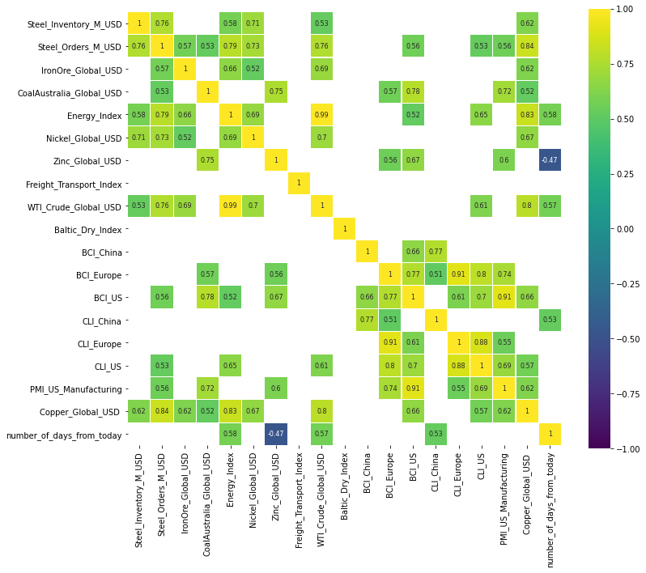
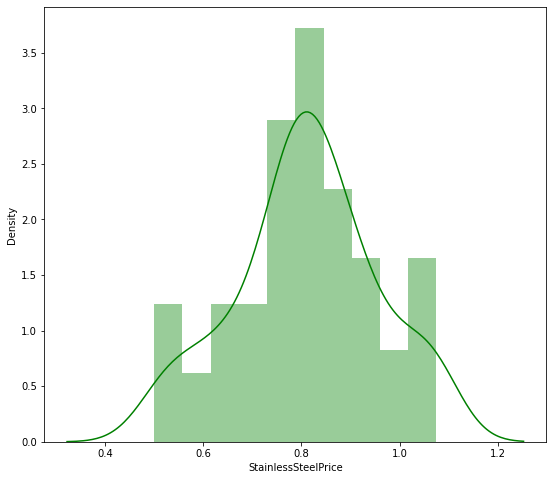
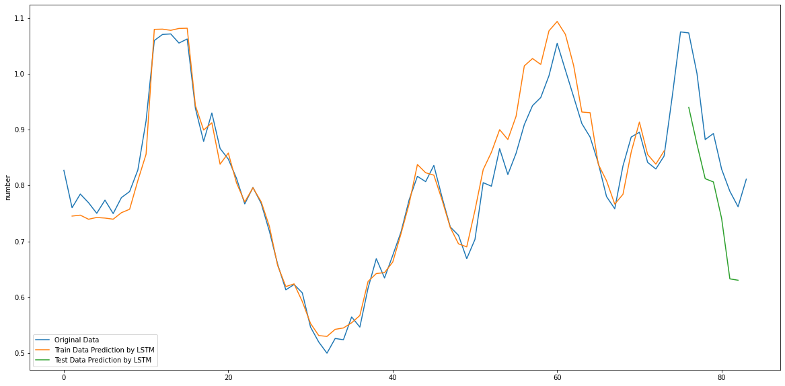

# Chemovator - Stainless Steel Price Forecasting

Welcome to the **Chemovator** project! 🎉  
This project aims to forecast stainless steel prices using various statistical, machine learning, and deep learning techniques. The project includes data exploration, feature engineering, model building, and performance evaluation.

## 📊 Project Overview

In this project, we:
1. Conducted **Exploratory Data Analysis (EDA)** to gain insights into the dataset and understand the relationships between features.
2. Implemented different methods for forecasting stainless steel prices, including:
   - **Statistical Models**: Prophet and SARIMA.
   - **Machine Learning Models**: Linear Regression, LASSO, Ridge Regression, XGBoost, Neural Networks.
   - **Deep Learning Models**: LSTM and Deep Neural Networks.
3. Evaluated the models using **Mean Absolute Percentage Error (MAPE)** and **Directional Symmetry**.
4. Selected features from the dataset to improve forecast accuracy.

## 🚀 Project Structure

The project is organized as follows:

- **`data/`**: Contains the dataset used for training and testing the models.
- **`src/`**: Contains the source code files:
    - **`config.py`**: Configuration settings for the models.
    - **`model.py`**: Contains the implementation of various models (Prophet, SARIMA, etc.).
    - **`evaluation.py`**: Evaluation functions for measuring model performance.
    - **`main.py`**: Main script to run the data processing, model training, and evaluation.
- **`outputs/`**: Stores the output images, such as correlation matrices and prediction graphs.
    - **`correlation-matrix.png`**: Visual representation of correlations between features.
    - **`prediction-graph.png`**: Graph showing the predicted vs actual stainless steel prices.
    - **`stainless-steel-price-distribution.png`**: Distribution plot of the stainless steel prices.
- **`requirements.txt`**: Lists the required dependencies for running the project.
- **`README.md`**: This file you are reading now.

---

## 🔎 Exploratory Data Analysis (EDA)

The EDA was performed to understand the dataset and make the forecasting models more effective. The following steps were completed:

1. **Missing Values Check**: Identified and handled missing data.
2. **Distribution of Numerical Variables**: Visualized the distribution of numerical variables.
3. **Relationship Between Independent Features & Target (Stainless Steel Price)**: Analyzed how features relate to the price.
4. **Correlation Analysis**: Removed highly correlated independent features to avoid multicollinearity.
5. **Trend and Seasonality**: Analyzed and displayed trends, seasonality, and patterns in the data.

**Correlation Matrix**:
Here’s a correlation matrix of the features in the dataset:


**Price Distribution**:
The distribution of stainless steel prices:


---

## 📈 Price Forecasting Models

The project used the following methods to forecast stainless steel prices:

### 1. **Statistical Models**:
- **Prophet**: Used for forecasting with seasonality.
- **SARIMA**: Seasonal AutoRegressive Integrated Moving Average model.

### 2. **Machine Learning Models**:
- **Linear Regression**: Simple model to predict the price.
- **LASSO**: Regularized linear regression for improved performance.
- **Ridge Regression**: Regularized linear regression for feature selection.
- **Gradient Boosting (XGBoost)**: A boosting method to improve prediction accuracy.
- **Neural Networks**: Used for learning complex patterns.

### 3. **Deep Learning Models**:
- **LSTM (Long Short-Term Memory)**: A deep learning method specifically for time series data.
- **Deep Neural Networks**: A fully connected neural network for regression tasks.

---

## 🧑‍💻 Model Training and Evaluation

### Feature Selection:
We used the features from **Column C (Steel_Inventory_M_USD)** to **Column T (Copper_Global_USD)** to improve accuracy.

### Model Insights:
1. **Time-based Features**: We incorporated time and date, alongside independent features, for training time series models like Prophet, SARIMA, and LSTM.
2. **Time as a Variable**: We created a new feature representing the number of days from today to the forecasting date and used it in machine learning models like Neural Networks and Gradient Boosting.

### Model Evaluation Criteria:
- **MAPE (Mean Absolute Percentage Error)**: Measures the accuracy of predictions.
- **Directional Symmetry**: Assesses whether the model correctly predicts the direction of the price change.

---

## 📊 Model Performance

### **Prediction Graph**:
Here’s a graph showing the predicted vs actual stainless steel prices:



---

## 🔑 Conclusion

- **Best Performing Model**: Among all models tested, the **Prophet model** outperformed others with a **MAPE of 4.25%**.
- **Cross-validation** was used to evaluate the model, and for each year, 2 data points were used to test the model.
- The final model was evaluated with 13 independent features to forecast the stainless steel prices effectively.

---

## 🛠 Setup & Installation

### 1. Clone the repository:

```bash
git clone https://github.com/sureshkuc/chemovator.git
```

### 2. Install dependencies:

```bash
pip install -r requirements.txt
```

### 3. Prepare the dataset:
Place the dataset in the `data/` folder.

### 4. Run the project:

```bash
python src/main.py
```

This will execute the data processing, model training, and evaluation scripts.

---

## 📑 License

This project is licensed under the **MIT License**. See the [LICENSE](LICENSE) file for details.

---

## 🤝 Contributing

Feel free to contribute to this project! If you have suggestions or improvements, open an issue or submit a pull request.

---

---

## 💬 Contact

If you have any questions or suggestions, feel free to reach out:  
- Email: skcberlin dot gmail.com  
- LinkedIn: 

---
